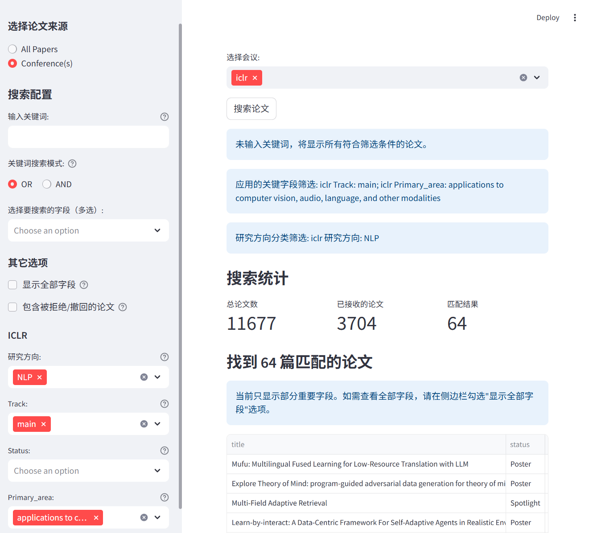

# PaperCompass

PaperCompass 是一个本地论文检索与管理工具。它提供了便捷的论文搜索、分类和浏览功能，帮助用户快速找到感兴趣的学术论文。

**在线体验**: [https://papercompass.streamlit.app](https://papercompass.streamlit.app)

## 主要功能

- **多领域论文检索**: 支持计算机视觉、自然语言处理、机器学习等多个领域的论文搜索
- **关键词过滤**: 通过关键词快速筛选相关论文
- **会议/期刊分类**: 按照顶会/顶刊分类浏览论文
- **本地部署**: 支持在本地环境运行


## 本地部署

### 1. 克隆仓库并安装依赖

```bash
# 克隆仓库
git clone https://github.com/li-aolong/PaperCompass.git
cd PaperCompass/tools

# 创建虚拟环境（可选）
# conda create -n papercompass python=3.10
# conda activate papercompass

# 安装依赖
pip install -r requirements.txt
```

### 2. 运行应用

```bash
streamlit run app.py
# 应用将在本地启动，通常为 http://localhost:8501
```

<div align="center">
  
</div>


## 数据更新

从PaperList获取最新论文数据

```bash
# 添加paperlist远程仓库
git remote add paperlist https://github.com/papercopilot/paperlists

# 获取最新数据
git fetch paperlist

# 更新论文数据（包含多个会议的数据）
git checkout paperlist/main -- aaai acl acmmm aistats colm corl cvpr eccv emnlp iccv iclr icml ijcai nips siggraph siggraphasia wacv www
```

## 项目结构

```
PaperCompass/
├── tools/              # 工具脚本和应用程序
│   ├── app.py          # Streamlit应用主程序
│   └── img/            # 图片资源
├── aaai/               # AAAI会议论文数据
├── cvpr/               # CVPR会议论文数据
├── iclr/               # ICLR会议论文数据
└── ...                 # 其他会议数据
```

## 贡献指南

欢迎对PaperCompass项目做出贡献！您可以通过以下方式参与：

1. 在[Issue](https://github.com/li-aolong/PaperCompass/issues)区提出bug或提出新功能建议
2. 提交[Pull Request](https://github.com/li-aolong/PaperCompass/pulls)改进代码或文档
3. 在[讨论区](https://github.com/li-aolong/PaperCompass/discussions)参与讨论改进论文搜索方法
3. 帮助更新或扩充论文数据库

## 致谢

- 感谢[PaperCopilot/PaperLists](https://github.com/papercopilot/paperlists)项目提供的论文源数据
- 感谢[@hhh2210](https://github.com/hhh2210)提供基础的本地搜索工具
